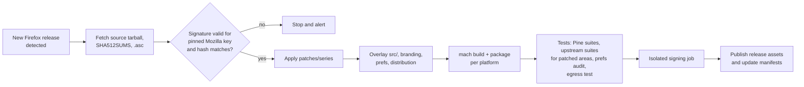

# Pine — Design Document

| | |
|---|---|
| **Status** | Draft for review |
| **Last updated** | 2026-10-02 |
| **Decisions so far** | Thin patch layer on upstream Firefox · tracks Firefox **Release** channel |

Pine is a security-focused desktop browser built on Firefox (Gecko) with the
sidebar and multitasking workflow popularised by Arc: vertical tabs in a
sidebar, Spaces, Favorites, auto-archiving "Today" tabs, split view, a command
bar, Peek and a mini window for external links.

This document covers what we are building, what we are deliberately not
building, how Pine relates to Firefox, the threat model, and how features and
hardening are implemented. Open decisions are collected in
[§12](#12-open-questions).

---

## Contents

1. [Goals and non-goals](#1-goals-and-non-goals)
2. [Background](#2-background)
3. [Design principles](#3-design-principles)
4. [Threat model](#4-threat-model)
5. [Architecture: how Pine modifies Firefox](#5-architecture-how-pine-modifies-firefox)
6. [The Pine UI layer](#6-the-pine-ui-layer)
7. [Features](#7-features)
8. [Security and privacy hardening](#8-security-and-privacy-hardening)
9. [Release engineering](#9-release-engineering)
10. [Testing](#10-testing)
11. [Milestones](#11-milestones)
12. [Open questions](#12-open-questions)
13. [References](#13-references)

---

## 1. Goals and non-goals

### Goals

| # | Goal | How we measure it |
|---|------|-------------------|
| G1 | An Arc-style sidebar and multitasking workflow on Firefox | Feature set in [§7](#7-features) shipped and usable as a daily driver |
| G2 | **Ship every Firefox security release fast** | Pine release within **48 h** of a Firefox release containing security fixes; **24 h** for fixes to actively exploited bugs |
| G3 | Hardened, privacy-respecting defaults with no data collection | No telemetry; no Pine-operated service ever receives browsing data; egress test passes ([§10](#10-testing)) |
| G4 | A small, auditable diff against Firefox | Patch budget in [§5.3](#53-patch-rules-and-budget) respected; every patch documented |
| G5 | Linux, macOS and Windows desktop builds | Signed, auto-updating builds on all three |

G2 is the goal the others are traded against. A browser that ships Firefox
security releases late is less secure than Firefox itself, regardless of how
well its prefs are hardened.

### Non-goals

- **Anonymity.** Pine reduces tracking and fingerprinting but does not try to
  make users indistinguishable from each other. People who need that should
  use Tor Browser or Mullvad Browser.
- **Chrome extension support.** Pine runs Firefox WebExtensions from
  addons.mozilla.org (AMO) only.
- **Mobile.** Desktop only for v1.
- **Pine accounts or a Pine cloud.** No sign-in, no Pine sync service, no
  server-side storage of Spaces, Boosts or anything else.
- **AI features.** Firefox's AI features are blocked by default
  ([§8.3](#83-data-collection-and-sponsored-content-removed)), and Pine adds none.
- **Engine changes.** We don't modify Gecko, SpiderMonkey, networking or the
  sandbox, except to turn on something more secure that upstream has already
  built.

---

## 2. Background

### Arc

Arc (The Browser Company) introduced the sidebar-first layout with Spaces,
Favorites, pinned and auto-archiving tabs, split view, the command bar, Peek
and Little Arc. It is Chromium-based. Since May 2025 it has been in
maintenance mode with security patches only, following The Browser Company's
acquisition by Atlassian. We are taking its interaction model, not its code.

Arc also shows what can go wrong when a browser has its own cloud features:
CVE-2024-45489 let an attacker run arbitrary JavaScript in other users'
browsers through misconfigured Firebase access rules on **Boosts**. Pine's "no
Pine cloud" non-goal and its handling of Boosts ([§7.9](#79-deferred-and-not-planned))
follow from this.

### What Firefox already provides

Upstream Firefox has gained much of the plumbing an Arc-style browser needs:

| Firefox feature | Shipped in | Pine uses it for |
|---|---|---|
| Revamped sidebar + vertical tabs | 136 (Mar 2025) | Base of the Pine sidebar |
| Tab groups | 138 | Folders inside a Space's pinned section |
| Split view (two tabs side by side) | 149 | Split view |
| "Open Link in Split View", reverse panes | 150 (Apr 2026) | Split view |
| Containers (contextual identities) | long-standing | Sign-in isolation between Spaces |
| AI controls / "Block AI enhancements" | 148 | Off-by-default AI |

Every feature we build on upstream is one we don't have to maintain while
rebasing, which directly serves G2 and G4.

### Existing Firefox derivatives

- **Zen Browser** (MPL-2.0) already ships an Arc-like UI on Firefox:
  workspaces, compact mode, split view and "Glance". It is the closest
  reference implementation. We decided **not** to fork it. Forking a fork adds
  a second hop between a Mozilla security fix and our users, and it means
  taking on a large UI diff we didn't design. Because Zen is MPL-2.0, we can
  still learn from it and reuse individual files, keeping their licence
  headers.
- **LibreWolf** and **arkenfox** are the main public sources for hardened
  Firefox defaults. Pine's preference set ([§8.2](#82-default-preferences))
  will start from a review of both.

---

## 3. Design principles

These principles are how we settle design disagreements. Where two conflict,
the one listed first wins.

1. **Stay close to upstream.** Use a build option or a pref before adding a
   file, and add a file before patching an upstream one. Every patch slows
   down every future security release.
2. **Every web page is a normal Firefox tab.** Peek, Little Pine, split panes
   and Favorites all show web content in real tabbrowser tabs, so Fission site
   isolation, the content sandbox, Enhanced Tracking Protection (ETP),
   containers and permissions apply to them. Pine never creates its own
   `<browser>` elements for web content.
3. **Pine's UI code is privileged code.** It runs in the parent process with
   chrome privileges, so a bug in it can bypass the content sandbox. It is
   held to the rules in [§6.2](#62-rules-for-privileged-code).
4. **The user can always see the real origin.** Pine may hide or collapse
   chrome, but the current site's origin, connection security and permission
   indicators must stay reachable, and permission prompts must always have a
   visible anchor.
5. **Secure by default, user in control.** Defaults are hardened, but users
   can change them in Settings. We don't silently lock settings, and we tell
   users when they've moved away from Pine's defaults.
6. **Pine doesn't run services that see browsing.** The only server Pine runs
   is the update and download endpoint. It receives as little information as
   the updater needs ([§9.4](#94-updates)).

---

## 4. Threat model

### Assets

The user's browsing data (history, cookies, sessions, saved passwords, form
data); signed-in accounts on the web; the integrity of the Pine binary and its
updates; the user's identity across sites.

### Adversaries and mitigations

| Adversary | Capabilities | Pine's mitigations |
|---|---|---|
| **Malicious website** | Runs arbitrary JS/Wasm, attempts engine exploits, phishing and UI spoofing, fingerprinting | Firefox's sandbox and Fission unchanged; fast patching (G2); HTTPS-Only; Safe Browsing; fingerprinting protection; Pine UI never renders web-supplied strings as markup; origin always reachable (principle 4) |
| **Network attacker** (hostile Wi-Fi, ISP, on-path) | Observes and tampers with traffic | HTTPS-Only Mode; DNS over HTTPS; HSTS preload; CRLite revocation; all Pine endpoints HTTPS with signed payloads |
| **Trackers / ad tech** | Third-party scripts, cross-site cookies, bounce tracking, referrers | ETP Strict; bundled uBlock Origin; cross-origin referrer trimming; Global Privacy Control; per-Space containers |
| **Malicious or compromised extension** | WebExtension APIs within granted permissions | Signature enforcement compiled in; AMO only; Pine adds no privileged extension APIs |
| **Supply chain** | Tampered Firefox source, compromised CI, stolen signing keys, hijacked update channel | Upstream source verified against a pinned Mozilla release key; signing isolated from builds; MAR-signed updates; two-person review for patches; reproducible-build goal ([§9](#9-release-engineering)) |
| **Pine itself** (our servers, our team) | Whatever our infrastructure receives | No browsing data reaches Pine; minimal update requests; open source |

### Out of scope

- Malware or an attacker already running as the user on their machine.
- Physical access to an unlocked device (we rely on OS disk encryption and screen lock).
- A user deliberately installing a malicious but validly signed extension; we warn as Firefox does.
- Adversaries who need to de-anonymise users across sessions; that is Tor Browser's threat model.

---

## 5. Architecture: how Pine modifies Firefox

### 5.1 Repository layout

The Pine repository **never contains Firefox source**. It contains a pin to a
Firefox release and everything needed to turn that release into Pine.

```
pine/
├── upstream.json          # pinned Firefox version + expected tarball SHA-512
├── keys/                  # pinned Mozilla release-signing key fingerprint
├── scripts/               # fetch / verify / patch / overlay / build / package
├── mozconfigs/            # per-platform build configuration
├── patches/
│   ├── series             # ordered list of patches
│   └── *.patch            # each with a rationale header (§5.3)
├── src/                   # files copied into the Firefox tree ("overlay")
│   └── browser/components/pine/   # all Pine UI code (§6)
├── branding/pine/         # icons, names, about dialog
├── prefs/pine.js          # Pine default preferences (§8.2)
├── distribution/          # bundled extensions (uBlock Origin)
├── tests/                 # prefs audit, network egress test, packaging checks
├── ci/ and .github/       # pipelines
└── docs/
```

### 5.2 Ways of changing Firefox, cheapest first

Every change uses the cheapest option that works. Each step down this list
costs more on every rebase:

| Rung | Mechanism | Rebase cost | Examples |
|---|---|---|---|
| 1 | **Build configuration** (`mozconfig`) | ~none | branding, app name, update channel, crash reporter off |
| 2 | **Default prefs** (`prefs/pine.js`, pulled into `browser/app/profile/firefox.js` via its preprocessor) | very low | hardening, telemetry off, enabling vertical tabs |
| 3 | **New files** (overlay into `src/`) | low; breaks only if an API we call changes | Pine UI modules, CSS, Fluent strings, tests |
| 4 | **Patches to upstream files** | high; can conflict every release | hook points in `browser.xhtml`, tabbrowser, sidebar, urlbar |

### 5.3 Patch rules and budget

- **One concern per patch.** Each patch starts with a header:

  ```
  Pine-Patch: sidebar-space-hooks
  Why: Adds an event hook so Pine can filter tabs by Space before render.
  Upstream: bug NNNNNNN (filed) | not upstreamable (Pine-specific UI)
  Drop-when: upstream lands an equivalent hook
  Owner: <name>
  ```

- **Prefer hook patches.** A patch should add a small extension point that
  Pine's overlay code uses, not carry Pine logic itself.
- **Security-sensitive paths need extra review.** A patch touching `security/`,
  `netwerk/`, `dom/`, `js/`, `ipc/`, sandbox code or the updater needs two
  reviewers and a written justification.
- **Upstream what we can.** If a hook is useful beyond Pine, file it upstream
  and record the bug number in the header.
- **Initial budget: ≤ 30 patches and ≤ 2,000 changed upstream lines at v1.0.**
  CI reports the current count on every build. Going over the budget is a
  conscious decision recorded in the PR.

### 5.4 Tracking upstream

Pine follows the Firefox **Release** channel: a major release about every four
weeks, plus dot releases in between.

- **Watch for releases.** A scheduled job polls Mozilla's product-details
  version feed. When a new Release version appears, it opens a version-bump PR
  that updates `upstream.json` and starts the full pipeline.
- **Rebase early against Beta.** A nightly job applies the patch series to the
  current **Firefox Beta** and builds it. Conflicts show up four to eight weeks
  before they matter, so release day is normally just a version bump.
- **Dot releases** (security "chemspills") take the same pipeline. Since our
  patches already apply to the major version, these should need no manual work.
- **Measure G2.** The time from Mozilla's release to Pine's is recorded for
  every release and reviewed monthly.

---

## 6. The Pine UI layer

### 6.1 Where the code lives

All Pine UI code is new files under `browser/components/pine/` in the Firefox
tree, overlaid from `src/`:

- system ES modules (`*.sys.mjs`) for state: Spaces, archive, routing rules;
- custom elements (`*.mjs`) and CSS for the sidebar, Space switcher, command
  bar and Peek;
- Fluent (`.ftl`) strings for localisation;
- tests (`browser.toml` mochitests and xpcshell tests).

Files are registered through `jar.mn` / `moz.build`. Patches to upstream files
only add hook points (see [§5.3](#53-patch-rules-and-budget)).

### 6.2 Rules for privileged code

Pine's UI runs with the system principal in the parent process. A bug there
can do more damage than a bug in web content, so:

1. **Never parse markup from the web.** Page titles, URLs, favicons and
   search suggestions are written with `textContent`, DOM APIs or Fluent
   arguments, never `innerHTML` or similar. This is enforced with Mozilla's
   ESLint config, including `no-unsanitized`.
2. **No remote code.** No scripts, stylesheets or configuration are fetched
   from the network. (Firefox already blocks `eval` in the parent process; we
   keep that.)
3. **Favicons come from Firefox's favicon service.** Pine never fetches icons
   itself.
4. **Treat the content process as compromised.** Pine avoids new
   `JSWindowActor`s that accept messages from content. Any it does add
   validate every message and are security-reviewed.
5. **State stays local.** Persistent data lives in the profile directory and is
   written atomically (`IOUtils`). Nothing is uploaded.
6. **Respect private windows.** Pine features check
   `PrivateBrowsingUtils.isWindowPrivate` and never persist anything from
   private windows.

### 6.3 Window layout

```
+------------------+--------------------------------------------------+
| o o o   <  >  C  |                                                  |
| [ github.com   ] |                                                  |
| +--+--+--+--+    |                                                  |
| |F |F |F |F |    |   Web content: a normal Firefox tab, inset with  |
| +--+--+--+--+    |   rounded corners so the edge of chrome is clear |
| Work         v   |                                                  |
| > Pinned         |                                                  |
|   > Folder       |                                                  |
| ---- Today ----- |                                                  |
| + New Tab        |                                                  |
|   tab            |                                                  |
|   tab | tab      |   (split pair shown as one row)                  |
|                  |                                                  |
| v  [] . o .   +  |                                                  |
+------------------+--------------------------------------------------+
  F = Favorite   o = current Space in switcher   v = downloads   [] = archive
```

The horizontal tab strip and top toolbar are hidden. Navigation buttons and a
compact address field move into the sidebar. When the sidebar is collapsed it
slides out on hover at the window edge.

---

## 7. Features

### 7.0 Arc → Pine mapping

| Arc | Pine | Built on |
|---|---|---|
| Sidebar with vertical tabs | Pine sidebar | Firefox sidebar + vertical tabs, restyled and extended |
| Spaces | Spaces | Tab hiding + SessionStore metadata |
| Profiles (per Space) | Space sign-in identity | Firefox containers |
| Favorites | Favorites | Pinned tabs tagged by container |
| Pinned tabs and folders | Space pins and folders | Pinned tabs + native tab groups |
| Today tabs + auto-archive | Today + Archive | New (Pine) |
| Split View (up to 4) | Split view (2 panes in v1) | Native split view (149+) |
| Command Bar | Command bar | Firefox address bar providers |
| Peek | Peek | Normal tab shown in an overlay |
| Little Arc | Little Pine | Compact window for external links |
| Air Traffic Control | Link routing | New (Pine) |
| Boosts | Deferred; CSS-only if ever | — |
| Easels, Notes, Library, Arc Max (AI) | Not planned | — |

### 7.1 Sidebar

Built **on** Firefox's vertical-tabs sidebar, not as a replacement. Firefox's
own tab strip already handles drag and drop, multi-select, tab groups,
accessibility and extension integration. Re-implementing it would be Pine's
largest ongoing rebase burden.

Pine adds:

- the Favorites grid;
- the Space header and switcher;
- the Pinned / Today split;
- an address field and navigation buttons;
- collapse and hover-reveal;
- per-Space theme colours, applied through CSS custom properties. These
  respect light/dark mode and high-contrast (`forced-colors`) mode.

**Origin and permission visibility (principle 4).** In Firefox, the site
identity box and the permission icons in the address bar are where permission
prompts (camera, microphone, location and so on) anchor. Pine's sidebar
address field keeps those elements. When the sidebar is collapsed:

- a permission prompt reveals the sidebar, or anchors to a fallback inside
  the window frame;
- hovering or focusing the top edge shows the full origin and connection
  security;
- web content is always inset inside a chrome-drawn frame, so anything that
  looks like browser UI *inside* the frame is visibly part of the page.

### 7.2 Spaces

A **Space** is a named, coloured set of tabs (pinned and Today) with an icon.
Users switch Spaces with the switcher, a keyboard shortcut, or a horizontal
swipe.

**Data model**

- Space metadata (id, name, icon, colour, sign-in identity, sort order) is
  stored in `pine/spaces.json` in the profile.
- Each tab records its Space with `SessionStore.setCustomTabValue(tab,
  "pine-space", id)`, so membership survives restarts and crash recovery with
  the rest of the session.
- Switching Space hides the previous Space's tabs and shows the new one's
  (`gBrowser.hideTab` / `showTab`). Hidden tabs are skipped by Ctrl+Tab and
  the Ctrl+1…8 shortcuts, which is what we want.
- Tabs in other Spaces that haven't been used for a while are unloaded
  (`gBrowser.discardBrowser`) to save memory, in addition to Firefox's own
  low-memory tab unloading.

**Sign-in identities (security model)**

Arc ties Spaces to browser profiles. Pine ties them to Firefox **containers**.

- When a user creates a Space, they choose **"Share sign-ins with ⟨Space⟩"**
  or **"Separate sign-ins"**. Choosing separate sign-ins creates a new
  container.
- Containers isolate cookies, local storage, IndexedDB, cache and other
  site data. Being signed in to a site in one Space doesn't sign you in to it
  in another, and trackers can't link activity across Spaces through stored
  state. This is stronger than Arc's default and comes from the engine rather
  than Pine code.
- History, bookmarks, extensions and settings are **shared** across containers.
  The UI must say this plainly and not claim profile-level isolation.
- The default Space uses the default identity (`userContextId` 0) for maximum
  extension and site compatibility.
- A container is fixed when a tab is created. Moving a tab to a Space with a
  different identity **reopens** it in the destination container. The UI
  warns that the user may need to sign in again.

**Risks**

- Extensions that use the WebExtension tab-hiding API (for example other
  tab-grouping extensions) can conflict with Spaces. Pine tags the tabs it
  hides and re-applies Space visibility on `TabShow` events. The
  compatibility notes will list known conflicting extensions.
- A future "isolated profile" Space (a separate Firefox profile in its own
  window) is possible but is not in v1.

### 7.3 Favorites, pinned tabs, Today and Archive

- **Favorites** are pinned tabs marked as favorites and drawn as an icon grid.
  They belong to a *sign-in identity*, so they appear in every Space that
  uses that identity. This matches Arc, where Favorites belong to a profile.
- **Pinned** tabs belong to one Space. They can be arranged in **folders**,
  which are Firefox's native tab groups, so session restore and extensions
  already understand them. "Reset to pinned URL" restores a pinned tab's
  original address.
- **Today** holds a Space's unpinned tabs. A tab not accessed for a set time
  (default **12 h**; options 24 h, 7 days, 30 days, never; based on
  `tab.lastAccessed`) is closed and moved to the **Archive**.
- **Archive** stores URL, title, Space and time closed in a compressed JSON
  file in the profile. It is limited in size and age (default 30 days), and
  users can search it from the command bar.
  - The archive is browsing history. It must be wiped by *every*
    history-clearing path: Clear Recent History, clear-on-shutdown and
    "Forget About This Site". Pine listens for Firefox's purge notifications
    (e.g. `browser:purge-session-history`) and has tests for each path.
  - Nothing is archived from private windows.

### 7.4 Split view

Pine uses **Firefox's native split view** (149+) unchanged, so it behaves like
Firefox. Pine shows a split pair as a single row in the sidebar (as Arc does)
and adds keyboard shortcuts. Arc supports up to four panes. Supporting more
than two is deferred and should be built **upstream first** rather than as a
Pine patch.

### 7.5 Command bar

Ctrl/⌘+T opens a centred, floating instance of the **Firefox address bar**
rather than a new search UI. It already handles search, history, bookmarks,
switch-to-tab and quick actions, and it already renders web-supplied
suggestions safely as text.

Pine adds address-bar *providers* for:

- switching Space;
- moving a tab to a Space;
- searching the archive;
- Pine commands (toggle sidebar, new Space, copy URL and so on).

Whether keystrokes are sent to a search provider for suggestions is an open
question ([§12](#12-open-questions)).

### 7.6 Peek

When the user clicks a link from a Favorite or pinned tab to a different site,
the link opens in **Peek**: a floating panel over the current page. Esc closes
it, and "Expand" promotes it to a regular tab in the Space.

The Peek page is a **normal tab** in the same Space and container (principle
2), displayed in an overlay. It is hidden from the tab list until it is
expanded. It gets the full address and identity UI, and permission prompts
anchor to the Peek panel.

### 7.7 Little Pine (links from other apps)

Links that arrive from other apps (Pine as the default browser) open in a
compact **Little Pine** window. From there the user can promote the page to a
Space with one click or dismiss it. External URLs go through Firefox's normal
command-line handling, so no new entry points are added.

**Security option:** "Open links from other apps in a temporary container."
Each Little Pine window gets a fresh container that is deleted (with its data)
when the window closes. This protects existing sessions from cross-site
request forgery triggered by a link and from cross-app tracking. Whether it is
on by default is an open question ([§12](#12-open-questions)).

### 7.8 Link routing

Users can set rules mapping hosts to Spaces (Arc's "Air Traffic Control"),
e.g. `*.atlassian.net → Work`.

Rules apply only to **new top-level loads**: new tabs, Little Pine, and links
opened from other Spaces. They never reroute navigation inside a tab. Rerouting
mid-navigation would break OAuth and SSO redirect chains, and it would give a
site a way to move itself into a different container. Rules are stored
locally with Space metadata.

### 7.9 Deferred and not planned

- **Boosts** (per-site custom styles/scripts): deferred. If built, they will be
  **CSS only**, stored locally, never synced and never shareable. Arc's
  CVE-2024-45489 came from exactly the combination we exclude: JavaScript plus
  cloud sharing.
- **Four-pane split view**: upstream-first, after v1.
- **Easels, Notes, Library, AI features**: not planned.

---

## 8. Security and privacy hardening

### 8.1 Engine and build: keep upstream's protections

Pine's builds **must keep** the protections in Mozilla's official builds.
Shortcuts that third-party Firefox builds sometimes take are forbidden:

| Must keep | Why |
|---|---|
| Fission (site isolation) and the content-process sandbox at upstream levels | The primary defence against engine exploits |
| Wasm-sandboxed libraries (RLBox; build with a WASI sysroot, never `--without-wasm-sandboxed-libraries`) | Isolates font, spelling, media and XML libraries in-process |
| Add-on signature enforcement compiled in (`MOZ_REQUIRE_SIGNING`) | Users can't be tricked into turning it off with a pref |
| Upstream toolchains via `mach bootstrap`, with artifact hashes recorded | We already trust Mozilla's toolchain; this pins exactly what we used |
| The same compiler hardening flags and allocator as upstream | No "faster" builds that drop hardening |
| The standard Firefox user agent | A distinct UA makes Pine users *more* fingerprintable; Pine must look like Firefox to sites |

Build changes: Pine branding (`--with-branding`, app name), our update
channel and update URL, our MAR verification keys, and the crash reporter
disabled. Telemetry reporting is not compiled in, and the data-reporting
prefs are also off as a second layer.

### 8.2 Default preferences

The full list lives in `prefs/pine.js` and will come from a line-by-line
review of arkenfox and LibreWolf (milestone M0). Representative defaults:

| Area | Pref (representative) | Pine default | Rationale |
|---|---|---|---|
| Transport | `dom.security.https_only_mode` | `true` | Upgrade all loads; warn before HTTP |
| Transport | `security.tls.enable_0rtt_data` | `false` | Avoid TLS early-data replay |
| DNS | `network.trr.mode` | *open question* | DoH resolver and fallback behaviour ([§12](#12-open-questions)) |
| Tracking | `browser.contentblocking.category` | `"strict"` | ETP Strict, including fingerprinting protection |
| Tracking | `privacy.globalprivacycontrol.enabled` | `true` | Send GPC |
| Tracking | `network.http.referer.XOriginTrimmingPolicy` | `2` | Only the origin in cross-origin referrers |
| WebRTC | `media.peerconnection.ice.default_address_only` | `true` | Limit local IP exposure |
| Speculation | `network.prefetch-next`, `network.dns.disablePrefetch`, `browser.urlbar.speculativeConnect.enabled` | off | No connections the user didn't ask for |
| Attack surface | `pdfjs.enableScripting` | `false` | Disable JavaScript in PDFs |
| Downloads | `browser.safebrowsing.downloads.remote.enabled` | `false` | Keep local list checks; don't send download metadata to a remote service |
| Passwords | `signon.autofillForms` | `false` | Fill only on user action, preventing silent credential harvesting by injected forms |
| Fingerprinting | `privacy.resistFingerprinting` | `false` (opt-in "Strict" mode) | Breaks many sites; offered as a clearly labelled opt-in |

Users can change all of these. Settings shows a **"Pine defaults changed"**
indicator listing anything the user has moved away from the hardened
baseline, with a one-click reset (principle 5).

**No `policies.json` by default.** Enterprise policies would let us lock
settings, but they also show "managed by your organization" and use the file
that real enterprise deployments need. Pine sets defaults instead. Locked
policies remain available to organisations that deploy Pine.

### 8.3 Data collection and sponsored content removed

- **Telemetry, studies and experiments**: not compiled in, and data reporting,
  Normandy/Nimbus studies and recommendation feeds are disabled by pref.
- **Sponsored content**: sponsored top sites, sponsored stories and sponsored
  Firefox Suggest results are off.
- **Add-on recommendations** in the add-ons manager are off.
- **AI features**: Firefox 148's "Block AI enhancements" control is **on** by
  default. Users can turn individual features back on; local translations
  should be considered for re-enabling, since they run on-device.
- **Crash reports**: crash reporter disabled at build time. If we add one
  later, it must be opt-in for each crash.

### 8.4 Security services we keep on

Removing data collection must not remove security features that depend on
network updates. Pine **keeps**:

- **Remote Settings** security collections: OneCRL, CRLite (certificate
  revocation), intermediate certificate preloading, and the add-on blocklist;
- **ETP / Shavar** tracker lists;
- **Safe Browsing** phishing and malware protection using the local list
  (only hashed URL prefixes are checked against Google). This needs a Google
  API key ([§12](#12-open-questions));
- **AMO** add-on update checks;
- **HSTS preload** and the Mozilla root store as shipped.

### 8.5 Extensions

- **uBlock Origin** is bundled as a distribution add-on, so it is present
  from first launch without a network fetch. It updates from AMO, and users
  can remove it.
- Only signed extensions from AMO install, the same as Firefox Release.
- Pine adds **no** privileged extension APIs.

### 8.6 Things we deliberately don't change

- **User agent and other web-visible signals**: Pine must look like Firefox
  to websites (see §8.1).
- **The certificate root store**: Mozilla's, as shipped.
- **Default content-process count, Fission and sandbox levels**: upstream's.

---

## 9. Release engineering

### 9.1 Pipeline



- **Source verification.** The Firefox source tarball, `SHA512SUMS` and
  `SHA512SUMS.asc` are downloaded from Mozilla's release archive. The
  signature is checked against a Mozilla release-key fingerprint **pinned in
  this repo**, never against a key fetched alongside the files.
- **Build infrastructure.** A Firefox build needs tens of GB of disk and
  hours of CPU. GitHub's standard hosted runners are too small, so full
  builds need larger hosted runners or self-hosted builders, with `sccache`.
  Cheap checks (patch-apply, lint, Pine unit tests) run on standard runners
  for every PR. Firefox's build system supports cross-compiling macOS and
  Windows builds from Linux, which keeps all builders on one hardened image.
  Infrastructure choice is an open question.
- **Release cadence.** Pine has its own channel layered on Firefox: e.g.
  `pine 150.0.3-1` is Firefox 150.0.3 plus Pine build 1. A Pine-only fix
  increments the suffix.

### 9.2 Signing and keys

| Artifact | Signature |
|---|---|
| Windows installer and binaries | Authenticode (code-signing certificate) |
| macOS app | Apple Developer ID, hardened runtime with Firefox's entitlements, notarized |
| Linux tarball | Detached signature (minisign/GPG) and published SHA-256 |
| Update packages | **MAR signature** with Pine's own key pair (public keys compiled into the updater; primary and secondary keys for rotation) |

Keys live in an HSM or cloud KMS. Signing runs in a **separate job** that
receives only the build outputs and their hashes, never the build
environment. Releases also publish build provenance attestations.

### 9.3 Distribution

| Platform | Packages | Notes |
|---|---|---|
| Linux | Tarball (self-updating), Flatpak | Inside Flatpak, Firefox can't create the user namespaces its Linux sandbox uses for filesystem and network isolation (seccomp filtering still applies). The **tarball / native package is the reference security configuration**; Flatpak is for convenience. |
| macOS | Signed, notarized DMG | Universal binary (arm64 + x86_64) |
| Windows | Signed installer | x86_64 first; arm64 later |

### 9.4 Updates

- The Firefox updater with **Pine's MAR keys**. A tampered or downgraded
  update is rejected even if the update server is compromised.
- **Static update manifests** (generated `update.xml` per channel, platform
  and version, on a CDN) rather than running Mozilla's Balrog service.
- **Minimal update requests.** Firefox's default update URL template includes
  OS version, locale and build details. Pine's template sends only what's
  needed to choose a package (version, platform/architecture, channel). Server
  logs are short-lived and contain no IP-linked analytics.
- The updater is on by default. Unpatched browsers are the main real-world
  risk.

### 9.5 Reproducibility

Goal for **v1.x**: bit-for-bit reproducible Linux builds, verified by a second
independent builder before release. Windows and macOS are reproducible up to
signing. Until we get there, we publish build provenance and toolchain
hashes for every release.

---

## 10. Testing

| Suite | What it checks | When |
|---|---|---|
| Patch-apply | Patch series applies cleanly to the pinned Release and the current Beta | Every PR; nightly against Beta |
| Lint | ESLint (Mozilla config, `no-unsanitized`), Stylelint, Fluent | Every PR |
| Pine unit and integration tests | xpcshell for Spaces/archive/routing state; browser mochitests for sidebar, Spaces, Peek, Little Pine, command bar | Every build |
| Upstream suites for patched areas | tabbrowser, sidebar, sessionstore, urlbar, contextual identity, split view | Every build |
| **Prefs audit** | Starts the *packaged* build and asserts every Pine security default and build-time protection (§8.1–8.2) | Every build; blocks release |
| **Network egress test** | Scripted first launch, idle and browsing session through a logging proxy. Fails if any host outside the allowlist is contacted (Remote Settings, Shavar, Safe Browsing, AMO, Pine updates, configured DoH resolver, visited sites) | Every release build; blocks release |
| Privacy wipe tests | Every history-clearing path removes Pine's archive and Space history | Every build |
| Update test | Previous release → new release through a signed MAR; tampered MAR rejected | Every release |

Pine relies on Mozilla's fuzzing for the engine. Pine's parent-process code
gets a security review before v1.0 and for every new IPC actor.

---

## 11. Milestones

| Milestone | Scope | Exit criteria |
|---|---|---|
| **M0 Foundations** | Fetch/verify/patch/overlay/build pipeline; branding; `prefs/pine.js` from arkenfox/LibreWolf review; telemetry and sponsored content off; bundled uBO; Linux builds | Linux build passes prefs audit and egress test; Beta-tracking job is green |
| **M1 Sidebar & Spaces** | Pine sidebar, Spaces with sign-in identities, Favorites, pinned + folders, Today + Archive, collapse with origin/permission handling | Daily-drivable on Linux; privacy wipe tests pass |
| **M2 Multitasking** | Split view integration, command bar, Peek, Little Pine, link routing, keyboard shortcuts | Feature tests pass; UX review against §7 |
| **M3 Ship** | macOS and Windows builds; signing, notarization, MAR updates, update server; security review; public beta | One full Firefox release cycle shipped within the G2 targets |
| **Later** | CSS-only Boosts, 4-pane split (upstream-first), isolated-profile Spaces, sync | — |

---

## 12. Open questions

Each question has a recommendation where we have one.

| # | Question | Recommendation |
|---|---|---|
| Q1 | **Platform order** | Linux first (cheapest CI, reference sandbox), then macOS (Arc's main user base), then Windows |
| Q2 | **Build infrastructure**: larger GitHub runners vs. self-hosted builders | Decide after measuring an M0 Linux build. Self-hosted is cheaper at volume but must be hardened as release infrastructure |
| Q3 | **Default search engine** and whether search suggestions (sending keystrokes) are on by default | A privacy-respecting default engine; suggestions off with a first-run choice |
| Q4 | **DNS over HTTPS**: resolver and mode (fallback vs. strict) | A no-logging resolver in fallback mode, user-selectable; strict mode available |
| Q5 | **Safe Browsing API key.** Google's Safe Browsing API is for non-commercial use only; commercial use requires the paid Web Risk API | Fine while Pine is non-commercial; revisit if that changes |
| Q6 | **Use of Mozilla services** (Remote Settings, Shavar, AMO, optionally Sync) by a third-party build | Other derivatives do this; confirm the terms before public release |
| Q7 | **Sync**: Firefox Sync via Mozilla accounts, none, or self-hosted | Support Firefox Sync (end-to-end encrypted, no Pine server); Space metadata isn't synced in v1 |
| Q8 | **Temporary container for links from other apps** on by default? | Off by default, prominent in onboarding; revisit after beta feedback |
| Q9 | **Licence** for Pine's own files | MPL-2.0, matching Firefox (modified Firefox files must stay MPL-2.0 anyway) |
| Q10 | **Name and trademark** | Check "Pine" for conflicts. Mozilla's trademark policy requires no Firefox branding in modified builds, which our branding step handles |
| Q11 | **Strict fingerprinting mode** (`privacy.resistFingerprinting`) | Opt-in toggle with a clear explanation of site breakage |

---

## 13. References

- Firefox 136 release notes: sidebar and vertical tabs — <https://www.mozilla.org/firefox/136.0/releasenotes>
- Firefox tab groups (138) — <https://heise.de/-10367703>
- Firefox 149 split view — <https://www.gigazine.net/gsc_news/en/20260325-firefox-149/>
- Firefox 149 beta: split view — <https://www.linuxtoday.com/blog/firefox-149-enters-beta-with-split-view-more-robust-http-3-upload-performance/>
- Firefox 148 AI controls / "Block AI enhancements" — <https://www.techspot.com/news/111453-firefox-148-rolls-out-promised-ai-kill-switch.html>
- Arc maintenance-mode status and Zen comparison — <https://supasidebar.com/blog/zen-vs-arc>
- Arc Boosts vulnerability CVE-2024-45489 — <https://security-tracker.debian.org/tracker/CVE-2024-45489>
- Google Safe Browsing usage limits and terms — <https://developers.google.com/safe-browsing/v4/usage-limits>
- Zen Browser source — <https://github.com/zen-browser/desktop>
- LibreWolf — <https://librewolf.net/>
- arkenfox user.js — <https://github.com/arkenfox/user.js>
- Firefox source docs — <https://firefox-source-docs.mozilla.org/>
- Mozilla trademark policy — <https://www.mozilla.org/foundation/trademarks/policy/>
